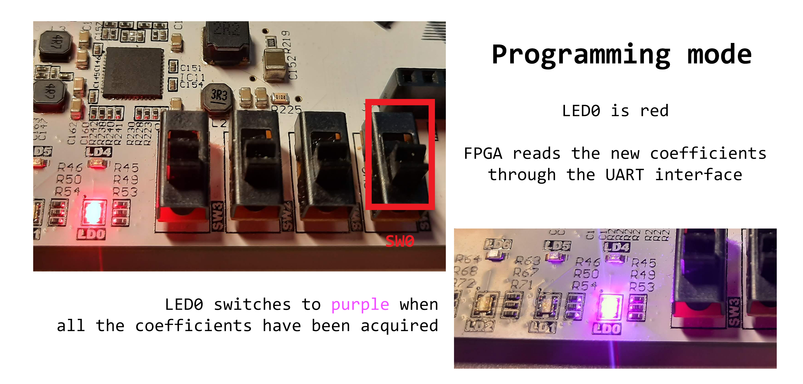
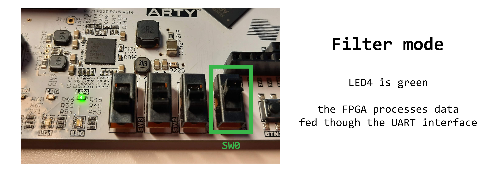

# **A 7-taps re-programmable Finite Impulse Response filter on FPGA**
#### Management and analysis of physical datasets (mod. A) project
#### AY 2021/2022 University of Padua

**Abstract** FIR filters are simple, yet effective filters which can be implemented on an FPGA. They may function as low-pass, high-pass or band-stop filters, depending on how the internal coefficients are tweaked. In this report we focus on a 7-taps FIR filter design, which takes input waveforms from a serieal USB source managed by a Python client. By default our filter operates as a low-pass 30Hz filter, but we have added a feature which allows the user to change run-time the filter specifications without running a new implementation in Vivado, which is notoriously a time-consuming step. In this report we will discuss the filter design, with references to its VHDL implementation. We will show Vivado simulations of the filter, as well as outputs coming from the FPGA board implementation. The simulations agree with the actual behaviour on FPGA boards, proving the correctness and efficiency of the design. Finally, we will characterize the response of the filter using both simulated and real sound samples.




## TODO

- [x] implementation
- [x] report
- [x] exam 4 feb 2022


## file structure

```
├── bin         | Vivado implementation of the FIR filter
├── bin_nosw    | Vivado implementation without switching capabilities, just for backup
├── bit         | bitstreams immplemented in Vivado
├── demo        | demo data: waveforms, simulations, ...
├── img         | for images
├── tex         | the report LaTeX source
└── tools       | scripts to manage the FPGA, send data & set the coefficients
    ├── send_data_fpga.py         (feed waveform to FPGA)
    ├── write_coefficients.py     (write the coefficients to FPGA)
    └── fpga_manager.ipynb        (to use the tools easily on a Jupyter notebook)

 + 7_fir_analysis.ipynb                The main analysis of filter, with comparisons 
                                      to software filters and simulations.
 + 7_fir_demo_switch.ipynb             A demo which uses the FPGA as both a lowpass & 
                                      highpass, by reprogramming runtime the coefficients.
 + 7_fir_guitar_experiment.ipynb       A demo which simulates a guitar pickup using FIR filters.
 
 + report.pdf                          The report of this project.

```
